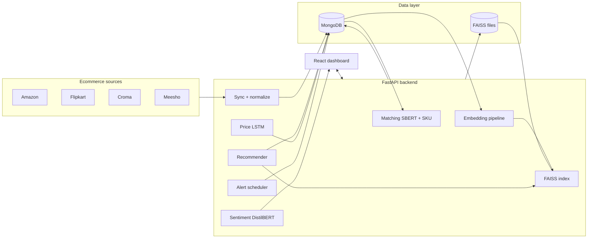

# PCS — System Architecture

## Overview

PCS (Price Comparison System) ingests offers from multiple ecommerce adapters, stores them in MongoDB, builds dense embeddings with Sentence Transformers, indexes them in FAISS for semantic search and recommendations, and exposes REST APIs consumed by a React dashboard.

## Module boundaries

| Layer | Responsibility |
|--------|----------------|
| `app/services/ecommerce` | Amazon / Flipkart / Croma / Meesho adapters → `ProductCreate`. |
| `app/services/product_repository` | CRUD, text index, `price_history` append on upsert. |
| `app/services/matching` | SKU clustering + SBERT similarity union-find for unmatched SKUs. |
| `app/services/embedding_pipeline` | Batch encode titles/descriptions → rebuild FAISS + persist. |
| `app/services/recommender` | Anchor embedding, FAISS neighbors, price-tier buckets + user prefs. |
| `app/ai/*` | SBERT encoder singleton, FAISS wrapper, HF sentiment pipeline, PyTorch LSTM. |
| `app/api/routers` | Thin HTTP handlers delegating to services. |

## Database schema (MongoDB)

Collections:

- **`products`** — one document per vendor listing.  
  Keys: `source`, `external_id` (unique compound), `title`, `description`, `category`, `brand`, `price`, `currency`, `rating`, `review_count`, `reviews[]`, `canonical_sku`, `matched_group_id`, `offer_label`, `discount_pct`, `delivery_days`, `delivery_text`, `free_shipping`, `embedding_version`, timestamps.

- **`price_history`** — `{ product_id, price, ts }` for charts, alerts, and LSTM sequences.

- **`user_preferences`** — `{ user_id, max_price, preferred_categories[], min_rating }`.

- **`price_alerts`** — `{ user_id, product_id, target_price, direction, active, baseline_price?, created_at, last_triggered_at }`.

Indexes are created on application startup (`ProductRepository.ensure_indexes()`).

## AI pipelines

1. **Semantic embeddings** — `product_to_text()` concatenates title, description, category, brand; `SentenceTransformer.encode` with L2-normalized vectors for cosine via inner product in FAISS.

2. **Product matching** — deterministic groups from `canonical_sku`; remaining rows clustered by pairwise cosine ≥ threshold (in-memory for moderate catalogs; shard or HDBSCAN for very large sets).

3. **Recommendations** — FAISS k-NN on anchor embedding; split neighbors into similar (top similarity), cheaper (price < 0.95× anchor), premium (price > 1.05× anchor), filtered by optional user prefs.

4. **Sentiment** — HuggingFace `pipeline("sentiment-analysis", model=distilbert-…-sst-2-english)` on review snippets.

5. **Price prediction** — `PriceLSTM` on recent `price_history`, plus optional **XGBoost** sliding-window regressor when enough points exist; `/api/predict/price/{id}` returns both and an ensemble headline when both run.

6. **Unified search** — `GET /api/search/unified?q=…` orchestrates multi-store fetch, matching, FAISS rebuild, group expansion, per-listing DistilBERT sentiment, composite **best-store** scoring (price, rating, sentiment, offers, delivery), dual price forecasts, and embedding-based alternatives.

## Deployment

- **Local dev**: MongoDB on `localhost:27017`, `uvicorn app.main:app` from `backend/`, `npm run dev` in `frontend/` (Vite proxies `/api` to `:8000`).

- **Docker Compose**: `mongo`, `backend` (FAISS persistence volume), `frontend` (Nginx static + reverse proxy to backend).

After containers start: open `http://localhost:8080` and run a product search (unified flow rebuilds FAISS as needed).

## Scaling notes

- Move FAISS to a dedicated vector service or GPU index for million-scale catalogs.
- Replace adapter `fetch_products` implementations with live marketplace APIs + rate limiting + idempotent upserts.
- Push alert channel from in-process logging to email/SMS/webhooks (extend `_alert_tick`).
