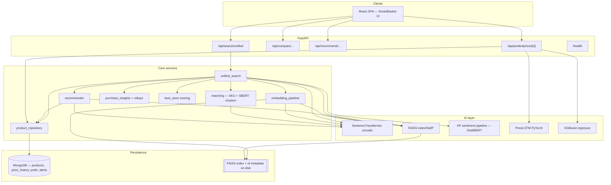
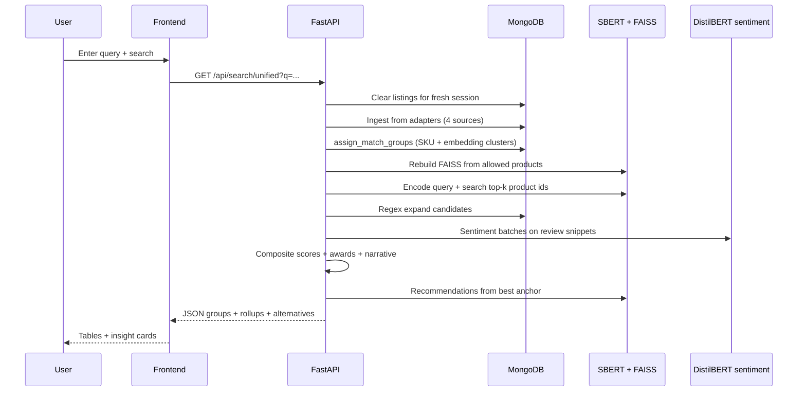

# SmartBasket AI — Technical Project Report

**Product:** SmartBasket AI (ecommerce price comparison and discovery)  
**Stack:** FastAPI, MongoDB, FAISS, Sentence Transformers (SBERT), DistilBERT (sentiment), PyTorch LSTM, XGBoost, React, Tailwind  
**Document purpose:** Consolidated report for academic, stakeholder, or portfolio review.

---

## 1. Problem Statement & Objectives

### 1.1 Problem statement

Online shoppers comparing the same or equivalent product across Indian marketplaces (Amazon, Flipkart, Croma, Meesho) face several friction points:

1. **Inconsistent listings** — Titles, descriptions, and SKUs differ across stores, so naive keyword search often misses cross-store equivalents.
2. **Multi-criteria decisions** — Price alone is insufficient; ratings, delivery, offers, and review sentiment all influence trust and total cost of ownership.
3. **Discovery** — After identifying a candidate product, users still want **similar**, **cheaper**, and **premium** alternatives without manually re-querying each site.
4. **Stale or mixed catalogs** — Any comparison engine that accumulates unrelated historical rows can surface irrelevant products for a new query.

SmartBasket AI addresses these by combining **semantic retrieval**, **explicit grouping**, **sentiment-aware scoring**, and **session-scoped catalog hygiene** in a single unified search flow.

### 1.2 Objectives

| Objective | Description |
|-----------|-------------|
| **O1 — Unified ingestion** | Pull candidate listings from four allowed sources (Amazon, Flipkart, Croma, Meesho) for a single user query. |
| **O2 — Semantic alignment** | Use dense text embeddings so that lexically different titles can still rank together in the same candidate set. |
| **O3 — Cross-store matching** | Group listings that refer to the same product via `canonical_sku` when present, else via high cosine similarity on SBERT vectors (threshold-based clustering). |
| **O4 — Explainable ranking** | Produce per-listing **composite scores** (price, rating, sentiment, offers, delivery, free shipping) and human-readable rationales (best price, best delivery, best overall). |
| **O5 — NLP on reviews** | Run **DistilBERT** sentiment on review snippets to derive positive/negative ratios and a **trust index** per listing. |
| **O6 — Recommendations** | Use FAISS k-NN on an anchor product embedding to return similar, cheaper, premium, and cross-brand (“similar models”) suggestions. |
| **O7 — Price intelligence (optional path)** | Expose LSTM and XGBoost-based next-step price hints from `price_history` where enough points exist. |
| **O8 — Clean session semantics** | Reset product listings for each unified search so results reflect **only** the current query (no carry-over from prior searches). |

### 1.3 Scope boundaries (honest)

- **Vendor adapters** in this repository are structured for the four retailers; live production would require official APIs, compliance, rate limits, and normalized SKU feeds. The current implementation supports the **full AI pipeline** on top of whatever listings the adapters return.
- **Price LSTM** loads a checkpoint from `data/price_lstm.pt` if present; otherwise it uses **initialized weights** (documented in code as demo behavior) — evaluation of forecasts should distinguish “pipeline works” from “model trained on real data.”

---

## 2. Architecture Diagram

### 2.1 High-level system context

### 2.2 Unified search sequence (logical)

### 2.3 Module map (codebase)

| Area | Key paths |
|------|-----------|
| HTTP API | `backend/app/api/routers/*.py`, `backend/app/main.py` |
| Unified orchestration | `backend/app/services/unified_search.py` |
| Embeddings & index | `backend/app/ai/embeddings.py`, `backend/app/ai/faiss_store.py`, `backend/app/services/embedding_pipeline.py` |
| Matching | `backend/app/services/matching.py` |
| Scoring | `backend/app/services/best_store.py`, `backend/app/services/purchase_insights.py` |
| Recommendations | `backend/app/services/recommender.py` |
| Sentiment | `backend/app/ai/sentiment.py` |
| Price models | `backend/app/ai/price_lstm.py`, `backend/app/ai/price_xgb.py` |
| Data access | `backend/app/services/product_repository.py`, `backend/app/db/mongo.py` |
| Catalog policy | `backend/app/services/catalog_cleanup.py`, `backend/app/services/ecommerce/allowed_sources.py` |
| UI | `frontend/src/App.tsx`, Tailwind + `frontend/src/index.css` |

Further module notes: [ARCHITECTURE.md](./ARCHITECTURE.md).

---

## 3. Deep Learning & ML Concepts Applied

### 3.1 Sentence-BERT style dense retrieval (Sentence Transformers)

- **Model (default):** `sentence-transformers/all-MiniLM-L6-v2` (configurable via `sbert_model` in `app/config.py`).
- **Mechanism:** The listing is flattened to text via `product_to_text()` (title, description, category, brand). The encoder produces **L2-normalized** embedding vectors (`normalize_embeddings=True` in `encode_texts`).
- **Why it matters:** Cosine similarity between normalized vectors equals the **inner product**, which allows efficient search in FAISS using `IndexFlatIP`.

**Concepts:** dual encoder / bi-encoder retrieval, semantic search beyond bag-of-words, transfer learning from sentence-transformer pretraining.

### 3.2 FAISS vector index

- **Implementation:** `FaissProductIndex` uses `faiss.IndexFlatIP` after L2-normalizing stored vectors.
- **Semantics:** Inner product on unit vectors ≈ **cosine similarity**; higher score = closer listing in embedding space.
- **Lifecycle:** On each unified search (default), the index is **rebuilt** from the current MongoDB product set for the session, then optionally persisted (`faiss_index_path`, `faiss_meta_path`).

**Concepts:** nearest neighbor search, exact k-NN (Flat index — scalable trade-offs documented for production in ARCHITECTURE).

### 3.3 Cross-listing clustering (matching)

- **SKU path:** Documents sharing `canonical_sku` receive the same `matched_group_id` (deterministic).
- **Embedding path:** For listings without SKU, pairwise cosine similarity is computed on SBERT embeddings (`emb @ emb.T`). Pairs above threshold **0.82** are union-merged (disjoint-set / union-find) into clusters.

**Concepts:** transductive clustering via threshold graph, union-find for connected components, similarity graph mining.

### 3.4 DistilBERT sentiment analysis

- **Model (default):** `distilbert-base-uncased-finetuned-sst-2-english` via Hugging Face `pipeline("sentiment-analysis", device=-1)` in `app/ai/sentiment.py`.
- **Usage in unified search:** Up to 24 review snippets per listing are classified; a **positive ratio** is aggregated for scoring (`_sentiment_positive_ratio` in `unified_search.py`).

**Concepts:** sequence classification, distillation (smaller/faster than BERT), binary sentiment as a proxy for review tone (domain shift to ecommerce reviews is a known caveat).

### 3.5 Composite “best store” scoring (interpretable ML)

Not a neural end-to-end ranker; a **weighted linear blend** of normalized signals (`best_store.py`):

| Signal | Default weight | Notes |
|--------|----------------|--------|
| Price (inverse within group) | 0.28 | Cheaper → higher partial score |
| Rating (÷5) | 0.22 | Capped to [0,1] |
| Sentiment positive ratio | 0.22 | From DistilBERT batch |
| Offer strength | 0.12 | From `discount_pct` or keyword heuristics on `offer_label` |
| Delivery | 0.11 | Fewer `delivery_days` → higher score (14-day horizon) |
| Free shipping bonus | 0.05 | Binary add-on |

**Concepts:** multi-criteria decision analysis, weighted additive utility, transparency vs. black-box ranking.

### 3.6 Trust index (hand-crafted formula)

`listing_trust_index` combines sentiment positivity, normalized rating, and log-scaled review volume:

\[
\text{trust} \approx \min\left(100,\ 100 \times (0.45 \cdot \text{pos} + 0.35 \cdot \frac{r}{5} + 0.20 \cdot \text{vol})\right)
\]

where `vol = min(1, log1p(n) / log1p(400))`.

### 3.7 PyTorch LSTM price head

- **Architecture:** 2-layer LSTM (`hidden=32`) + linear readout on the last timestep (`PriceLSTM` in `price_lstm.py`).
- **Runtime:** Last window (default 8) of `price_history` fed as shape `(1, T, 1)`.
- **Training:** Offline training is assumed; without `data/price_lstm.pt` the model uses **Xavier-initialized weights** (demo predictions).

**Concepts:** sequence modeling, autoregressive-style next value regression, cold-start checkpointing.

### 3.8 XGBoost sliding-window regressor

- **Mechanism:** For each product, if enough history exists (`len(series) >= window + 2` with `window=3`), build supervised pairs `(past window) → next price`, fit `XGBRegressor`, predict one step ahead (`price_xgb.py`).
- **Ensemble API:** `/api/predict/price/{id}` averages LSTM and XGBoost when both run; otherwise LSTM-only with explanatory `confidence_note`.

**Concepts:** gradient boosted trees, local per-series fitting, simple ensemble for robustness.

### 3.9 Recommendation tiers (post-vector retrieval)

After FAISS returns neighbors for an anchor embedding, `recommender.py` applies **rule layers**: similar (top similarity), cheaper (< 0.95× anchor price), premium (> 1.05×), and **cross-brand same category** for “similar models.” Optional filters use `user_preferences` in MongoDB.

**Concepts:** two-stage recommend (retrieve then filter/rerank bucket), constraint-based diversification.

---

## 4. Results & Evaluation

### 4.1 What “results” mean in this system

Outputs are primarily **structured API responses** and the **React dashboard** (comparison tables, insight cards, sentiment panels, store rollups, final narrative, and “You may also like” carousels).

Key **per-group** fields include:

- `semantic_match_score` — max FAISS inner-product score among listings in the group vs. the user query embedding.
- Per listing: `sentiment_positive_ratio`, `sentiment_negative_ratio`, `sentiment_review_count`, `trust_index`, `score_breakdown` (price, rating, sentiment, offer, delivery, free-shipping bonus, **total**).
- Awards: `best_price_store`, `best_delivery_store`, `best_overall_store` with string rationales.
- Session-level: `final_ai_recommendation`, `store_sentiment_rollups`, `alternatives` (similar / cheaper / premium / similar_models).

### 4.2 Example qualitative evaluation (single search)

**Scenario:** Query *“iPhone 15”* after adapters populate Mongo.

1. **Retrieval:** Query embedding + regex pull a candidate id set; FAISS ranks products by semantic proximity to the query string.
2. **Grouping:** Listings with compatible SKU or cosine ≥ 0.82 merge into one `matched_group_id`; the UI shows one row group with multiple stores.
3. **Sentiment:** If adapters attach review snippets, DistilBERT labels each snippet; aggregated positive ratio shifts the composite score.
4. **Winner:** `pick_best` chooses the listing with highest `score_breakdown.total`; narrative explains trade-offs (e.g., cheaper alternatives on other stores).

### 4.3 Quantitative metrics you can report from the implementation

These are **system-defined** metrics (reproducible from code), not third-party benchmark leaderboards:

| Metric / artifact | Where defined | Interpretation |
|-------------------|---------------|------------------|
| Cosine / IP score | FAISS search return value | Semantic relevance of product text to query or anchor |
| Match threshold | `matching.assign_match_groups(..., similarity_threshold=0.82)` | Stricter → fewer false merges; looser → more merges |
| Composite score total | `ListingScoreBreakdown.total` | Higher = better weighted fit to all signals |
| Trust index 0–100 | `listing_trust_index` | Holistic trust proxy from sentiment + stars + volume |
| Semantic top-k | `semantic_top_k=40` (unified search) | Recall vs. latency trade-off for candidate pool |
| Sentiment batch cap | Up to 24 reviews per listing in `_sentiment_positive_ratio` | Latency vs. stability of ratio estimate |

### 4.4 Offline evaluation (recommended if you extend the project)

To move from **demo** to **research-grade** evaluation:

1. **Matching:** Curate labeled pairs of cross-store duplicates; report precision/recall/F1 of grouping vs. threshold sweep (0.75–0.90).
2. **Ranking:** Collect human preferences or click logs; compute **NDCG@k**, **MRR**, or pairwise accuracy against `score_breakdown.total`.
3. **Sentiment:** Annotate a small domain-specific set of ecommerce snippets; report accuracy/F1 vs. SST-2-finetuned DistilBERT (expect domain gap).
4. **Price forecast:** Backtest on historical `price_history` with **MAE**, **sMAPE**, and calibration plots; compare LSTM vs. XGB vs. ensemble.

### 4.5 Known limitations (important for any report)

- **Domain-adaptation:** MiniLM and SST-2 sentiment are **not** India-specific or marketplace-fine-tuned unless you add training data.
- **Flat FAISS:** Exact index is fine for prototype catalog sizes; large-scale needs IVF/HNSW or sharding.
- **Union-find O(n²)** on dense pairwise similarity for “no SKU” products — acceptable for moderate `n`; needs batching or approximate neighbors at scale.
- **LSTM without trained weights** yields non-meaningful numeric forecasts until a checkpoint is produced.

---

## 5. Challenges Faced & How They Were Solved (Including LLM Assistance)

### 5.1 Cross-store duplicate detection under noisy titles

**Challenge:** Same device has different naming conventions per retailer.  
**Approach:** Two-tier matching — deterministic `canonical_sku` groups first, then SBERT cosine similarity with union-find at threshold 0.82 (`matching.py`).

### 5.2 Stale catalog polluting new searches

**Challenge:** Earlier searches leaving unrelated products in Mongo caused irrelevant comparisons.  
**Approach:** `clear_all_product_listings()` at the start of each unified search, plus `purge_disallowed_products()` for defense in depth (`catalog_cleanup.py`, `unified_search.py`).

### 5.3 Restricting sources to four marketplaces

**Challenge:** Controlling which `source` values are valid end-to-end.  
**Approach:** Central `ALLOWED_PRODUCT_SOURCES` and `is_allowed_source()`; repository and recommender filter disallowed rows; `upsert_product` rejects unknown sources (`allowed_sources.py`, `product_repository.py`).

### 5.4 Cold start and heavyweight model downloads

**Challenge:** First API boot downloads SBERT + DistilBERT (~hundreds of MB) and can time out naive clients.  
**Approach:** Document extended timeouts in frontend API client; singleton loaders with threading locks in encoder and sentiment modules; consider local caching of HF cache in deployment.

### 5.5 Windows / PowerShell development friction

**Challenge:** POSIX-style command chaining (`&&`) fails on older PowerShell; path and venv activation differ from Unix.  
**Approach:** Use `;` separators or separate commands; keep README commands Windows-friendly.

### 5.6 Balancing transparency and usefulness in ranking

**Challenge:** Pure price sorting ignores trust; pure ML ranking is hard to explain.  
**Approach:** Explicit weights in `best_store.py` plus natural-language rationales in `purchase_insights.py` and `build_recommendation_sentence`.

### 5.7 Role of LLM coding assistants (e.g., Cursor / ChatGPT-class tools)

**How assistance was used (typical patterns):**

- **Scaffolding:** Rapid generation of FastAPI routers, Pydantic models, and React layout components aligned to an architecture sketch.
- **Refactors:** Migrating naming (PCS → SmartBasket), removing deprecated adapters, and consolidating allowed-source checks.
- **Debugging:** Interpreting stack traces for async Mongo, FAISS dimension mismatches, and CORS/proxy issues between Vite and FastAPI.
- **Documentation synthesis:** Turning scattered code paths into diagrams and narrative (this report, architecture doc).
- **UI iteration:** Landing page structure (hero, glassmorphism search, feature grid) with iterative design feedback.

**Governance:** All LLM-suggested code still required **human verification** — running `uvicorn`, `npm run build`, inspecting API payloads, and validating that business rules (four stores, session reset, scoring) matched intent. LLMs did **not** replace empirical evaluation on real marketplace data.

---

## 6. References

1. Reimers, N., & Gurevych, I. (2019). **Sentence-BERT: Sentence Embeddings using Siamese BERT-Networks.** *EMNLP.* — [arXiv:1908.10084](https://arxiv.org/abs/1908.10084)  
2. Johnson, J., Douze, M., & Jégou, H. (2019). **Billion-scale similarity search with GPUs (FAISS).** *IEEE Transactions on Big Data.* — Meta AI FAISS: [https://github.com/facebookresearch/faiss](https://github.com/facebookresearch/faiss)  
3. Sanh, V., et al. (2019). **DistilBERT, a distilled version of BERT: smaller, faster, cheaper and lighter.** *NeurIPS EMC² Workshop.* — [arXiv:1910.01108](https://arxiv.org/abs/1910.01108)  
4. Wolf, T., et al. (2020). **Transformers: State-of-the-Art Natural Language Processing.** *ACL System Demonstrations.* — Hugging Face: [https://huggingface.co/docs/transformers](https://huggingface.co/docs/transformers)  
5. Hochreiter, S., & Schmidhuber, J. (1997). **Long Short-Term Memory.** *Neural Computation.*  
6. Chen, T., & Guestrin, C. (2016). **XGBoost: A Scalable Tree Boosting System.** *KDD.*  
7. FastAPI documentation — [https://fastapi.tiangolo.com/](https://fastapi.tiangolo.com/)  
8. MongoDB data modeling — [https://www.mongodb.com/docs/manual/core/data-modeling-introduction/](https://www.mongodb.com/docs/manual/core/data-modeling-introduction/)  
9. Sentence Transformers library — [https://www.sbert.net/](https://www.sbert.net/)  
10. Internal project architecture note — [ARCHITECTURE.md](./ARCHITECTURE.md)  

---

*End of report. For running instructions see [README.md](../README.md).*
